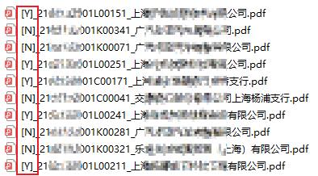

# Changelog

## [4.0.1] - 2020-02-15
### Changed
  * 取消压缩代码方式展现。
    > 虽然可以节约空间，但没有必要。

## [3.9.9] - 2020-02-13
### Added
  * 询证函下载，在重命名后的名称中新增识别是否相符。

## [3.9.8] - 2020-03-25
### Added
  * 修复：更换jquery资源的CDN加速服务为BootCDN。

## 以往更新
* Version 1.0
  * 首次上传： 使用 jQuery - AJAX load() 方法， 直接将“待办事项”清单和脚注调取过来。

* Version 1.1
  * 重大更新： Neko Trek 使用 jQuery - AJAX get() 方法 + button 事件， 初试效果，获取的内容相当纯净、干脆。

* Version 1.2
  * 尝试：重回 jQuery - AJAX load() 方法；
      * 无耻尝试：.load() 方法应该能够继承 jQuery 选择器的 :first 功能， 居然真的可以成功。
  * 美化：新增了一个待办事项类型的数组，在加载的过程中，随着文字的变换，可以知道加载到第几大类的待办事项。

* Version 1.3
  * 美化：添加 table 属性，直接调用原生 css 中的 tablebox 样式，与首页的其他内容显得浑然一体。

* Version 1.4
  * 修复Bug： 修改 load() 每次访问的子页面 url 为对应的真实子页面 ?ind=X ；
      * 可能由于后续子页面的 style.display 为 none 而无法获取 id。
      * Neko Trek的构造 form 请求的方法更好，但是我还不能理解其规则，暂存。
  * 美化：用jQuery元素表达方法重述原来的HTML元素，代码更加简洁； via : Neko Trek。
  * 美化：减少了不必要的新建DOM， table 元素更加简洁； via : Neko Trek。

* Version 2.0
  * 添加：进度条UI。

* Version 2.1
  * 更新：更改进度条配色，由淡蓝色3B8CF8变更为淡紫色CC66FF。
  * 更新：加载完毕后等待600毫秒，进度条消失。

* Version 2.3
  * 添加：在首页“待办事项”标签之上，插入“本月已报工时”和“本月已出差天数”，以示提醒。
      * 发现，在其他浏览器，如：QQ浏览器、360安全浏览器下，格式很奇怪，拟暂封存该更新。

* Version 2.4
  * 添加：在首页“待办事项”标签后，添加“动态报备”标签，可以点击直达动态报备界面，并起到提醒的目的。

* Version 2.5
  * 一脸懵逼造bug。

* Version 2.6
  * 更新：兼容内网域名（10.131.0.7）。

* Version 2.7
  * 添加：在首页“待办事项”标签之上，插入“本月已报工时”和“本月已出差天数”，以示提醒；
      * 其实这是在Version 2.3就开发了，当初有bug，目前已被各大浏览器最新版本修复了。
  * 添加：在首页“待办事项”和“动态报备”标签后，添加“申报工时”标签，可以点击直达当月已报工时界面；
      * 与网站置顶的快捷键略同，但更加符合操作习惯——先查看当月已报情况，再补充申报。

* Version 2.8
  * 添加：自动下载并重命名询证函回函扫描件；
  * 添加：批量下载询证函按钮。

* Version 2.9
  * 美化代码。

* Version 3.9.1
  * iframe下载询证函。

* Version 3.9.4
  * 增加：支持【询证函查询】可筛选大于等于指定日期进行批量下载。

